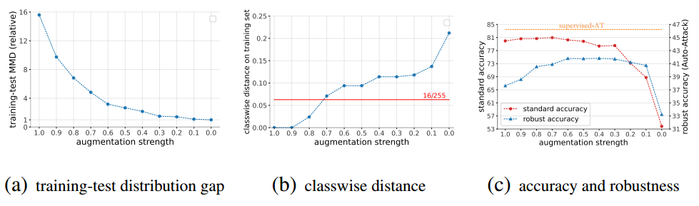
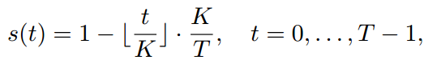
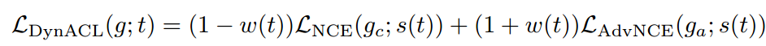
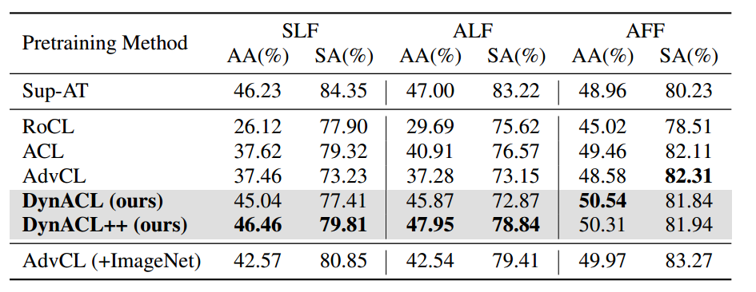
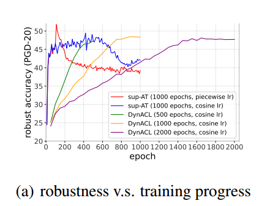

# 
># Rethinking the effect of data augmentation in adversarial contrastive learning
***

>图中，横轴表示数据增强的强度，越接近1则表示数据增强的强度越大。
图（a）（b）表明数据增强强度降低时，会减小训练集和测试集的分布差异，增大类间距离
图（c）表明数据增强的强度在（0.3~0.6）时鲁棒性较好，但是数据增强强度降低时准确率会下降。
启示：强数据增强会影响自对抗的鲁棒性，导致原始图像语义转移；弱数据增强则导致正确率的下降；因此折中：开始采用强数据增强学习更多特征，之后将数据增强强度退火以确保鲁棒性。
***
>动态数据增强模型：DynACL
动态数据增强公式：

t表示epoch。
loss：

loss表明：由于$w(t)$的影响，最初的$\mathcal{L}_{NCE}$其主要作用，即利用对比学习学到更多的特征；后续$\mathcal{L}_{AdvNCE}$起主导作用，提升鲁棒性。
***
>DynACL++ ：DynACL只处理了预训练任务，而DynACL++ 提出了后处理阶段改善对下游任务的性能。具体做法：利用k-means聚类产生伪标签，训练一个linear head，再利用伪标签对抗微调。

***
>**实验：**
  
该表表明模型可以增强鲁棒性

该图表明训练时间过长时，DynACL和DynACL++ 不会导致鲁棒性的过拟合。

> # A message passing perspective on learning dynamics of contrastive learning

