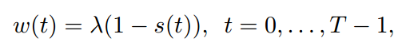

# 
># Rethinking the effect of data augmentation in adversarial contrastive learning
***

>图中，横轴表示数据增强的强度，越接近1则表示数据增强的强度越大。
图（a）（b）表明数据增强强度降低时，会减小训练集和测试集的分布差异，增大类间距离
图（c）表明数据增强的强度在（0.3~0.6）时鲁棒性较好，但是数据增强强度降低时准确率会下降。
启示：强数据增强会影响自对抗的鲁棒性，导致原始图像语义转移；弱数据增强则导致正确率的下降；因此折中：开始采用强数据增强学习更多特征，之后将数据增强强度退火以确保鲁棒性。
***
>动态数据增强模型：DynACL
动态数据增强公式：

t表示epoch。
loss：

loss表明：由于$w(t)$的影响，最初的$\mathcal{L}_{NCE}$其主要作用，即利用对比学习学到更多的特征；后续$\mathcal{L}_{AdvNCE}$起主导作用，提升鲁棒性。
***
>DynACL++ ：DynACL只处理了预训练任务，而DynACL++ 提出了后处理阶段改善对下游任务的性能。具体做法：利用k-means聚类产生伪标签，训练一个linear head，再利用伪标签对抗微调。

***
>**实验：**
  
该表表明模型可以增强鲁棒性

该图表明训练时间过长时，DynACL和DynACL++ 不会导致鲁棒性的过拟合。

> # Contranorm: a contrastive learning per-spective on oversmoothing and beyond 

>over-smooth现象：堆叠过多的GNN层—节点具有高度重叠的接收域—节点的嵌入变得十分相似，transformer中也会出现类似现象。

>特征相似度不能完全描述表征的质量和过度平滑的问题。
>因此提出了erank指标：X的特征值特征值$\sigma_1\geq\sigma_2\geq...\geq\sigma_n$,$p_i,1\leq i\leq n$,$H$为$p_i,1\leq i\leq n$的熵，erank（X）=exp（H），特征值的差异越大，erank的值越小，较小的erank就说明发生了dimensional collapse 。

>启发：
>Infoloss分为alignloss和uniform loss两部分，如下：
>
>
>$\mathcal{L}_{align}$的作用：使得正样本之间的距离减小，但是会导致所有的representation趋于一致，也就是dimensional collapse。
>$\mathcal{L}_{uniform}$作用：使得两两样本之间的距离尽可能大。消除dimensional collapse。

>根据对比学习中$\mathcal{L}_{uniform}$的启发，将其修改后用于图学习中：
> + 将图中所有节点的 $\mathcal{L}_{uniform}$相加：
> 
> 式中，节点$h_i$被看作是随机样本$x_i$的表征。
> + 为了梯度下降法优化$\hat{\mathcal{L}}_{uniform}$:
> 
> 
> 
> 实验表明，式中，$D^{-1}A和AD^{-1}$发挥着相同作用，因此只保留$D^{-1}A$:
> 
> 

>上式缺点：不一定完全起到uniform的作用，如$softmax(H_bH^T_b)=I$,则$H_t=(1-s/\tau)H_b$,仅仅是尺度发生了变换。
>对上式的修正的两种方法：
> （1） 加入正则化项
> （2）Layernorm：
> 
> Layernorm的效果更好，因此采用Layernorm并命名为ContraNorm

> # Chaos is a ladder:a new theoretical understanding of contrastive learning via augmentation overlap

> 对比学习是实例级的判别。但由于不同的类内图像的数据增强会有重叠（augmentation overlap）（如：两辆汽车的数据增强结果是两张轮胎的照片，这两张轮胎照片是相似的），因此对比学习过程也起到了聚类的作用，即类级的判别。因此数据增强会造成给类内实例造成混乱。
> 

你好

